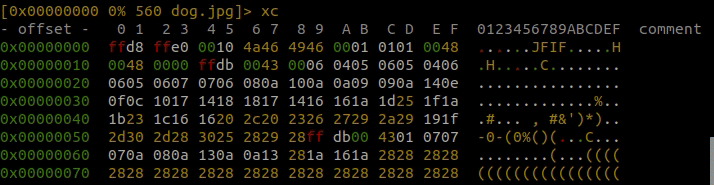
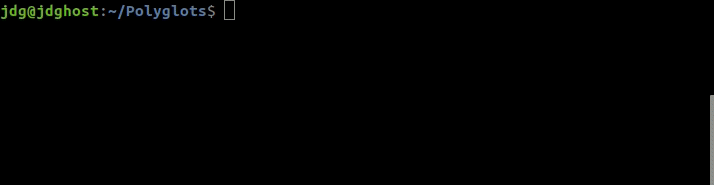
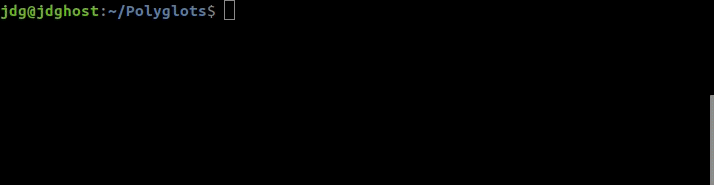
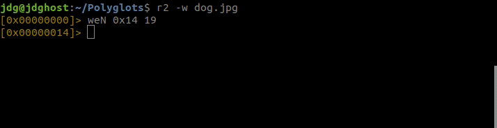
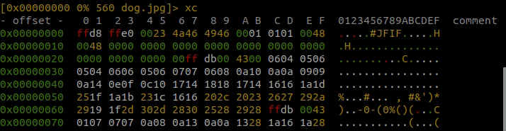

# Polyglots

## JPEG data structure
The following image shows in detail the data structure of which a JPEG file is composed.
<p align="center"></p>
<br>

To edit the content of the image we will use `Radare2`.

## Install Radare2
1. Run update command to update package repositories and get latest package information.
    ```bash
    ~$ sudo apt-get update -y
    ```
2. Run the install command with -y flag to quickly install the packages and dependencies.
    ```bash
    ~$ sudo apt-get install -y radare2
    ```

## Image to work
<p align="center"></p>
<br>

## Add data to image
1. Use Radare to add data into the image with the following command:
    ```bash
    ~$ r2 -w dog.jpg
    ```
2. We go into visual mode by typing `V` and pressing enter.
    ```bash
    [0x00000000]> V
    ```
    The content of the image will look as follows:
    ```
    [0x00000000 0% 2968 dog.jpg]> xc
    - offset -   0 1  2 3  4 5  6 7  8 9  A B  C D  E F  0123456789ABCDEF  comment
    0x00000000  ffd8 ffe0 0010 4a46 4946 0001 0101 0048  ......JFIF.....H
    0x00000010  0048 0000 ffdb 0043 0006 0405 0605 0406  .H.....C........
    0x00000020  0605 0607 0706 080a 100a 0a09 090a 140e  ................
    0x00000030  0f0c 1017 1418 1817 1416 161a 1d25 1f1a  .............%..
    0x00000040  1b23 1c16 1620 2c20 2326 2729 2a29 191f  .#... , #&')*)..
    0x00000050  2d30 2d28 3025 2829 28ff db00 4301 0707  -0-(0%()(...C...
    ...
    ```

    <p align="center"></p>
    <br>

3. From the offset `0x02` there are 2 bytes with value` ffe0` that correspond to a *magic number* that is used to indicate by the following 2 bytes the number of bytes that this code fragment will occupy before encountering the next *magic number*. In this case these 2 bytes have the hexadecimal value `0010`, that is, 16 in decimal, therefore the message in this section consists of the following 16 bytes: `0010 4a46 4946 0001 0101 0048 0048 0000`.

4. First modify this 2 bytes `0010` that indicate the size of the message. To do this press `C` to activate the cursor and to scroll through each byte. You need to press `i` to activate insert mode. Put the cursor on the offset `0x05`. Change this byte from `10` to `23`, which is the hexadecimal value that represents the ASCII character for `#` pad.
    ```
    [0x00000000 + 5> * INSERT MODE *
    - offset - | 0 1  2 3  4 5  6 7  8 9  A B  C D  E F| 0123456789ABCDEF  comment
    0x00000000 |ffd8 ffe0 0023 4a46 4946 0001 0101 0048| .....#JFIF.....H
    0x00000010 |0048 0000 ffdb 0043 0006 0405 0605 0406| .H.....C........
    ```
    <p align="center"></p>
    <br>

    The purpose of modifying this byte is, on the one hand, to extend the length of the header an additional number of bytes and, on the other hand, to indicate that the code below to fill the specified size is a comment.

5. Note that the size of the original header was marked with a value of `0x0010` and now is `0x0023`, so I need to add bytes for the header to match in size with the new value. To calculate the number of bytes that I have to add to the header I can use the `rax2` tool, which is a help of `Radare2` and we will use it as follows. First we will calculate the bytes that `0x0010` represents:
    ```bash
    ~$ rax2 0x0010
    16
    ```
    Then I calculate the bytes that the new value `0x0023` represents:
    ```bash
    ~$ rax2 0x0023
    35
    ```
    Now I calculate the difference between `35` and` 16`, and the result is `19`:
    ```bash
    ~$ echo "35-16" | bc
    19
    ```
    <p align="center"></p>
    <br>

6. Now I know we have to add an additional `19` bytes to the existing header. To do this I open `Radare2` again in write mode:
    ```bash
    ~$ r2 -w dog.jpg
    ```
    We go into *write extend* mode by typing `weN` to insert bytes at some address, and pressing enter.
    ```bash
    [0x00000000]> weN 0x14 19
    ```
    Where `0x14` (row `0x10`, column `4`, value `ff`) is the offset or address where I will insert the new bytes, and `19` is the number of bytes to insert.
    <p align="center"></p>
    <br>

7. Enter in visual mode again with `V` and pressing enter.
    ```
    [0x00000014]> V
    ```
    Can scroll up to the top with the mouse scroll and see the start of the file from the first offset. It looks like this:
    ```
    [0x00000000 0% 2968 (0x26:-1=1)]> xc
    - offset - | 0 1  2 3  4 5  6 7  8 9  A B  C D  E F| 0123456789ABCDEF  comment
    0x00000000 |ffd8 ffe0 0023 4a46 4946 0001 0101 0048| .....#JFIF.....H
    0x00000010 |0048 0000 0000 0000 0000 0000 0000 0000| .H..............
    0x00000020 |0000 0000 0000 00ff db00 4300 0604 0506| ..........C.....
    ...
    ```
    As you can see, hems successfully added 19 bytes with value `00` from offset `0x14` to offset `0x26` (row `0x20`, column `6`, value `00`), shifting all other bytes forward.
    <p align="center"></p>
    <br>

8. Now is the time to overwrite some of the bytes that I have added by pressing `i` to enter INSERT mode. For example, enter a carriage return (CR) by `0d` at offset `0x12` and line feed (LF) by `0a` at offset `0x13`:
    ```
    [0x00000000 + 20> * INSERT MODE *
    - offset - | 0 1  2 3  4 5  6 7  8 9  A B  C D  E F| 0123456789ABCDEF  comment
    0x00000000 |ffd8 ffe0 0023 4a46 4946 0001 0101 0048| .....#JFIF.....H
    0x00000010 |0048 0d0a 0000 0000 0000 0000 0000 0000| .H..............
    ...
    ```
    **Note**: *The concepts of line feed (`LF`) and carriage return (`CR`) are closely associated, and can be considered either separately or together. Although the design of a machine (typewriter or printer) must consider them separately, the abstract logic of software can combine them together as one event. This is why a newline in character encoding can be defined as `LF` and `CR` combined into one (commonly called `CR`+`LF` or `CRLF`).*
    <p align="center"></p>
    <br>

9. The next bytes from offset `0x14` are bytes that I can replace by adding text. For example, I press the tab to change columns and stay where the ASCII representation of the bytes is displayed. Now write ASCII characters directly, not bytes, for example `ls -lrt;exit;`.
    ```
    [0x00000000 + 33> * INSERT MODE *
    - offset -   0 1  2 3  4 5  6 7  8 9  A B  C D  E F |0123456789ABCDEF| comment
    0x00000000  ffd8 ffe0 0023 4a46 4946 0001 0101 0048 |.....#JFIF.....H|
    0x00000010  0048 0d0a 6c73 202d 6c72 743b 6578 6974 |.H..ls -lrt;exit|
    0x00000020  3b00 0000 0000 00ff db00 4300 0604 0506 |;.........C.....|
    ...
    ```
I change the column again by pressing the tabulator and stay again in the column of the bytes. To exit press `Esc` twice, type `q` (quit), retype `q` again and press enter.
    <p align="center"></p>
    <br>

10. Now I open the photo to see that it is still a normal photo. I can double click on the file to open it.
    <p align="center"></p>
    <br>

As you can see, there is no difference, even though I have entered a number of bytes that were not there before.

11. It's the moment to open the photo with a different program from the one we have configured by default to view photographs, for example with `cat` and passing the output to the executable `sh`, `bash` or the *shell* program of your choice.
    ```
    ~$ cat dog.jpg | sh
    : not found#JFIFHH
    total 324
    -rw-rw-r-- 1 jdg jdg  35149 abr  4 08:38 LICENSE
    -rw-rw-r-- 1 jdg jdg  34267 abr  4 08:53 dog_original.jpg
    -rw-rw-r-- 1 jdg jdg 173101 abr  4 10:00 JPEG.jpg
    -rw-rw-r-- 1 jdg jdg   6785 abr  4 19:33 README.md
    -rw-rw-r-- 1 jdg jdg  34286 abr  4 19:36 dog.jpg
    ```
    <p align="center"></p>
    <br>

Here is the question of this whole matter. We have run the `ls` program with the` -lrt` flags and have finally run the `exit` statement to force an exit from the program. The conclusion is that by using this information hiding technique I could run a program that would perform some unwanted action instead of executing these simple commands, on my computer or on other people's computers.

## Acknowledgment
My thanks to Dr. Alfonso Muñoz for the keynote talk from [RootedCON](https://www.rootedcon.com/) and [documentation](https://github.com/mindcrypt/polyglot), and [Abraham Pasamar](https://twitter.com/apasamar) for [this](https://www.youtube.com/watch?v=0S61uzx-Efk&t=) explanatory video.

## Links of interest
* [Alfonso Muñoz](https://twitter.com/mindcrypt): [Bipolar](https://github.com/mindcrypt/bipolar)
* [Enrique Soriano](https://twitter.com/e__soriano): [Polyglottar](https://sysfatal.github.io/polyglottar.html)
