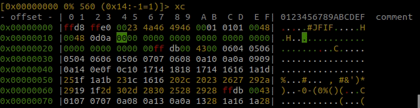
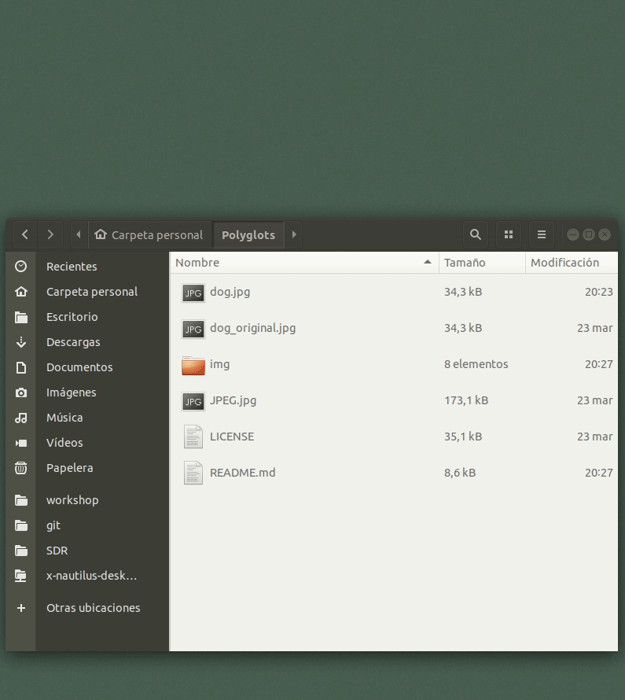

# Polyglots

## Estructura de datos de un archivo JPEG
La siguiente imagen muestra la estructra de datos de la que se compone un archivo JPEG.
<p align="center"></p>
<br>

Para editar el contenido de esta estructura de datos usaremos la herramienta `radare2`.

## Instalar Radare2
1. Primero actualizamos los repositorios y obtenemos la información más actual de los paquetes:
    ```bash
    ~$ sudo apt-get update -y
    ```

2. Instalamos `radare2` con el flag `-y` para aceptar todas las dependencias:
    ```bash
    ~$ sudo apt-get install -y radare2
    ```

## Imagen a trabajar
<p align="center"></p>
<br>

## Añadir datos a la imagen
1. Abrimos la imagen con `radare2` indicando el falg -w para modificar la estructura de datos::
    ```bash
    ~$ r2 -w dog.jpg
    ```

2. Una vez dentro de Radare entramos en modo visual escribiendo `V` y pulsando intro:
    ```bash
    [0x00000000]> V
    ```
    El contenido del archivo se verá de la siguiente manera:
    ```
    [0x00000000 0% 2968 dog.jpg]> xc
    - offset -   0 1  2 3  4 5  6 7  8 9  A B  C D  E F  0123456789ABCDEF  comment
    0x00000000  ffd8 ffe0 0010 4a46 4946 0001 0101 0048  ......JFIF.....H
    0x00000010  0048 0000 ffdb 0043 0006 0405 0605 0406  .H.....C........
    0x00000020  0605 0607 0706 080a 100a 0a09 090a 140e  ................
    0x00000030  0f0c 1017 1418 1817 1416 161a 1d25 1f1a  .............%..
    0x00000040  1b23 1c16 1620 2c20 2326 2729 2a29 191f  .#... , #&')*)..
    0x00000050  2d30 2d28 3025 2829 28ff db00 4301 0707  -0-(0%()(...C...
    ...
    ```

    <p align="center"></p>
    <br>

3. A partir el *offset* `0x02` hay 2 bytes con el valor `ffe0` que corresponden a un *magic number* que se utiliza para indicar mediante los siguientes 2 bytes el número de bytes que ocupará este fragmento de código antes de encontrar el siguiente *magic number*. En este caso, estos 2 bytes tienen el valor hexadecimal `0010`, es decir, 16 en decimal, por lo tanto el mensaje en esta sección consta de los siguientes 16 bytes: `0010 4a46 4946 0001 0101 0048 0048 0000`.

4. Primero hay que modificar estos 2 bytes `0010` que indican el tamaño del mensaje. Para hacer esto, presione `C` para activar el cursor y desplazarse por cada byte. Ahora presionamos `i` para activar el modo de inserción. Colocamos el cursor en el *offset* `0x05`. Cambiamos este byte de `10` a `23`, que es el valor hexadecimal que representa el carácter ASCII para la almohadilla `#`.
    ```
    [0x00000000 + 5> * INSERT MODE *
    - offset - | 0 1  2 3  4 5  6 7  8 9  A B  C D  E F| 0123456789ABCDEF  comment
    0x00000000 |ffd8 ffe0 0023 4a46 4946 0001 0101 0048| .....#JFIF.....H
    0x00000010 |0048 0000 ffdb 0043 0006 0405 0605 0406| .H.....C........
    ```
    <p align="center"></p>
    <br>

    El propósito de modificar este byte es, por un lado, extender la longitud del encabezado un número adicional de bytes y, por otro lado, indicar que los datos que usaremos para llenar el tamaño especificado son un comentario.

5. Hay que tener en cuenta que el tamaño del encabezado original ha pasado de tener el valor `0x0010` a `0x0023`, por lo que necesitaremos agregar una cantidad de bytes adicionales de modo que el encabezado coincida en tamaño con este nuevo valor. Para calcular la cantidad de bytes que debemos agregar al encabezado, podemos usar la herramienta `rax2`, es una utilidad que viene con `Radare2` y la usaremos de la siguiente manera. Primero calculamos los bytes que representa el valor `0x0010`:
    ```bash
    ~$ rax2 0x0010
    16
    ```
    Luego calculamos los bytes que representa el nuevo valor `0x0023`:
    ```bash
    ~$ rax2 0x0023
    35
    ```
    Ahora calculamos la diferencia entre `35` y `16`, y el resultado es `19`:
    ```bash
    ~$ echo "35-16" | bc
    19
    ```
    <p align="center"></p>
    <br>

6. Ahora sabemos que tenemos que agregar `19` bytes adicionales al encabezado existente. Para hacer esto, abrimos la imagen con `radare2` nuevamente en modo de escritura:
    ```bash
    ~$ r2 -w dog.jpg
    ```
    Entramos en el modo *write extend* escribiendo `weN` para insertar una cantidad de bytes a partir de la dirección que indiquemos.
    ```bash
    [0x00000000]> weN 0x14 19
    ```
    Donde `0x14` es el *offset* o la dirección donde insertaremos los nuevos bytes, y `19` es el número de bytes a insertar.
    <p align="center"></p>
    <br>

7. Entramos de nuevo en modo visual con `V` y presionamos intro.
    ```
    [0x00000014]> V
    ```
    Podemos desplazarnos hasta la parte superior con el scroll y ver el inicio del archivo desde el primer *offset*. Se veremos algo como esto:
    ```
    [0x00000000 0% 2968 (0x26:-1=1)]> xc
    - offset - | 0 1  2 3  4 5  6 7  8 9  A B  C D  E F| 0123456789ABCDEF  comment
    0x00000000 |ffd8 ffe0 0023 4a46 4946 0001 0101 0048| .....#JFIF.....H
    0x00000010 |0048 0000 0000 0000 0000 0000 0000 0000| .H..............
    0x00000020 |0000 0000 0000 00ff db00 4300 0604 0506| ..........C.....
    ...
    ```
    Como se puede ver, se han agregado con éxito 19 bytes con el valor `00` desde el *offset* `0x14` hasta el *offset* `0x26`, desplazando todos los demás bytes hacia adelante.
    <p align="center"></p>
    <br>

8. Ahora es el momento de sobrescribir algunos de los bytes que acabamos de agregar presionando `i` para entrar en modo INSERT. Por ejemplo, añadimos un retorno de carro (CR) con el valor `0d` en el *offset* `0x12` y un salto de línea (LF) con el valor `0a` en el *offset* `0x13`:
    ```
    [0x00000000 + 20> * INSERT MODE *
    - offset - | 0 1  2 3  4 5  6 7  8 9  A B  C D  E F| 0123456789ABCDEF  comment
    0x00000000 |ffd8 ffe0 0023 4a46 4946 0001 0101 0048| .....#JFIF.....H
    0x00000010 |0048 0d0a 0000 0000 0000 0000 0000 0000| .H..............
    ...
    ```
    **Nota**: *El concepto de avance de línea (CF) y retorno de carro (CR) están estrechamente asociados y pueden considerarse por separado o en conjunto. Así pues una nueva línea en la codificación de caracteres se puede definir como `LF` y `CR` combinadas (comúnmente `CR`+`LF` o `CRLF`).*
    <p align="center"></p>
    <br>

9. Los siguientes bytes a partir del *offset* `0x14` son bytes que podemos reemplazar agregando texto. Por ejemplo, presionamos el tabulador para cambiar de columna y posicionarnos donde se muestra la representación ASCII de los bytes. Ahora podemos escribir caracteres ASCII directamente, no bytes, por ejemplo `ls -lrt; salida;`.
    ```
    [0x00000000 + 68> * INSERT MODE *
    - offset -   0 1  2 3  4 5  6 7  8 9  A B  C D  E F |0123456789ABCDEF| comment
    0x00000000  ffd8 ffe0 0123 4a46 4946 0001 0101 0048 |.....#JFIF.....H|
    0x00000010  0048 0d0a 5347 6b67 5157 7870 5932 5573 |.H..SGkgQWxpY2Us|
    0x00000020  4948 526f 5a53 4277 5958 4e7a 6432 3979 |IHRoZSBwYXNzd29y|
    0x00000030  5a43 4270 637a 6f67 4e57 466e 5531 7436 |ZCBpczogNWFnU1t6|
    0x00000040  4a32 304b 0000 0000 0000 0000 0000 0000 |J20K............|
    ...
    ```
Vuelvo a cambiar la columna presionando el tabulador de nuevo y nos posicionamos de nuevo en la columna donde se ven los bytes. Para salir, presionamos `Esc` dos veces, escribimos `q` (quit) un par de veces y pulsamos Intro.
    <p align="center"></p>
    <br>

10. Ahora abro la foto para ver que sigue siendo una foto normal. Puedo hacer doble clic en el archivo para abrirlo.
    <p align="center"></p>
    <br>

Como se puede ver, no hay diferencia, a pesar de que hemos añadido una cantidad de bytes que antes no estaban ahí.

11. Es el momento de abrir la foto con un programa diferente al que hemos configurado de forma predeterminada para ver fotografías, por ejemplo con `cat`, y pasaremos la salida estándar al programa ejecutable `sh`, `bash` o *shell* que queramos.
    ```
    ~$ cat dog.jpg | sh
    : not found#JFIFHH
    total 324
    -rw-rw-r-- 1 jdg jdg  35149 abr  4 08:38 LICENSE
    -rw-rw-r-- 1 jdg jdg  34267 abr  4 08:53 dog_original.jpg
    -rw-rw-r-- 1 jdg jdg 173101 abr  4 10:00 JPEG.jpg
    -rw-rw-r-- 1 jdg jdg   6785 abr  4 19:33 README.md
    -rw-rw-r-- 1 jdg jdg  34286 abr  4 19:36 dog.jpg
    ```
    <p align="center"></p>
    <br>

He aquí la cuestión de todo este asunto. Hemos ejecutado el programa `ls` con las opciones `-lrt` y finalmente la instrucción `exit` para forzar una salida del programa. La conclusión es que al usar esta técnica de ocultación de información podría ejecutar un programa que realizaría alguna acción no deseada en lugar de ejecutar estos comandos shell simples, y podríamos hacerlo en nuestra computadora o en las de otras personas.

## Agradecimientos
Gracias al Dr. Alfonso Muñoz por la charla de la [RootedCON](https://www.rootedcon.com/) y el repo con [información](https://github.com/mindcrypt/polyglot) al respecto, y a [Abraham Pasamar](https://twitter.com/apasamar) por [este](https://www.youtube.com/watch?v=0S61uzx-Efk&t=) vídeo tan didáctico.

## Link de interés
* [Alfonso Muñoz](https://twitter.com/mindcrypt): [Bipolar](https://github.com/mindcrypt/bipolar)
* [Enrique Soriano](https://twitter.com/e__soriano): [Polyglottar](https://sysfatal.github.io/polyglottar.html)
